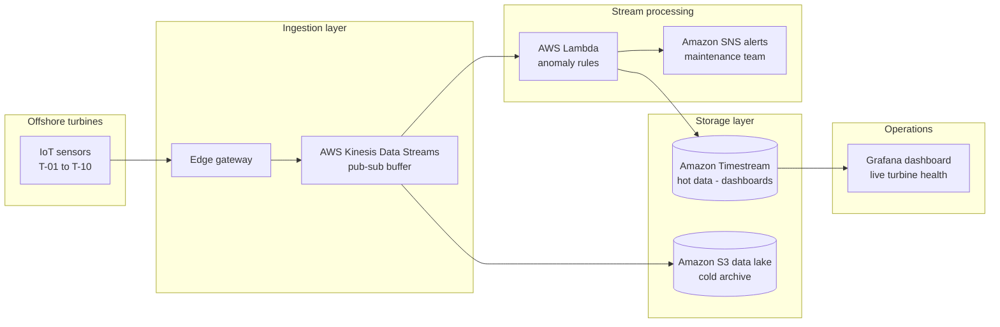

# AeroGrid

## what it is

IEUK 2026 (Bright Network, Technology and Engineering). The brief was: pandas over a 24-hour telemetry csv, flag turbines that break two anomaly rules, plus a short CTO memo with a proposed AWS path.

I added a stream after that. Same two rules, csv replayed into sqlite, alert only the first time a turbine fails. Local page over that db for the two that trip. Not live sensors, and I did not build Kinesis/Lambda - that stays a proposal in the memo.

On the sample (`telemetry_data.csv`, 5000 rows / 10 turbines): **T-04** (avg temp ~= 90.58 °C) and **T-07** (max vibration = 25.0 mm/s).

## layout

```
aerogrid/
  README.md
  analyze_telemetry.py   # batch (brief)
  stream_monitor.py      # stream + sqlite alerts (mine)
  dashboard.py           # local html over aerogrid.db (mine)
  engineering_report.md  # ~300 word cto memo from the brief
  architecture_diagram.png  # proposed AWS path from the brief - not built
  telemetry_data.csv
  tests/
  requirements.txt
  pytest.ini
  Dockerfile
  docker-compose.yml
  .dockerignore
```

## quick start

```bash
cd aerogrid
python3 -m venv .venv
source .venv/bin/activate
pip install -r requirements.txt

# brief - batch
python analyze_telemetry.py

# mine - stream (speed=0 for ci; try --speed 0.01 to watch)
python stream_monitor.py --csv telemetry_data.csv --db aerogrid.db --speed 0

# local page (fills db if empty)
python dashboard.py
```

Docker:

```bash
docker build -t aerogrid .
docker run --rm aerogrid                          # batch
docker run --rm aerogrid python stream_monitor.py --speed 0

docker compose up stream-monitor                  # sqlite on a named volume
docker compose --profile batch up batch-analysis
```

## stack

Python · pandas (batch) · stdlib csv + sqlite3 (stream) · pytest · Docker · Chart.js CDN (local dashboard)

## how its wired

Batch (`analyze_telemetry.py`) is the IEUK deliverable: load the csv, `groupby` turbine, flag if mean temperature > 85 °C or max vibration > 15 mm/s, print the failing IDs.

Stream (`stream_monitor.py`) is mine. `DictReader` one row at a time. Each turbine keeps a running sum/count (mean) and a peak vibration. Same thresholds. First time a turbine crosses into failing: print `ALERT`, insert one `alerts` row, latch so staying bad does not spam. Readings go into sqlite as they arrive. `--speed 0` for tests; bump it to watch the replay.

Dashboard (`dashboard.py`) serves a small page from that db (alerts table + T-04 / T-07 charts). Empty db -> it runs the stream first.

The diagram is the AWS path from the brief (buffer / rules / hot vs cold storage). I did not build that. Sqlite is the local stand-in.



Diagram: `architecture_diagram.png`
CTO memo: [`engineering_report.md`](engineering_report.md)

## whats interesting

- same two rules, two shapes. batch is pandas over the whole file. stream is per-turbine state updated row by row (running mean via sum/count, peak vibration)
- latch: first fail prints once and writes one `alerts` row. staying bad does not spam. recover would clear the latch - this sample never recovers (mean only gets hotter, max vibration only rises)
- stream mean is cumulative over the replay, not a sliding window. on this 5000-row file it still flags the same two as batch. a real window would need a deque of recent temps - i did not add that
- memo split: kinesis buffers when readings spike, lambda runs the rules, timestream for recent queries, s3 for older raw. sqlite here is so i could show the rules without aws
- pytest locks the sample result (T-04 temp, T-07 vibration), a healthy turbine stays off the list, missing columns raise, latch + sqlite persist, full stream replay matches batch

## limitations

- csv is a fixed 24-hour sample, not live turbines
- cumulative mean, not a sliding window - see above
- nothing here talks to kinesis / lambda / timestream
- sqlite commits per row - fine at 5k, would batch on a real stream
- dashboard is stdlib `http.server` on localhost, no auth

## tests

```bash
pytest -q
```

## demo

```bash
python dashboard.py
```

Then http://127.0.0.1:8765/ (fills `aerogrid.db` if it is empty).
